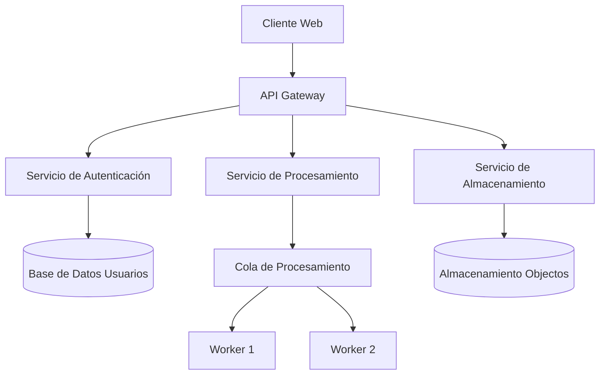
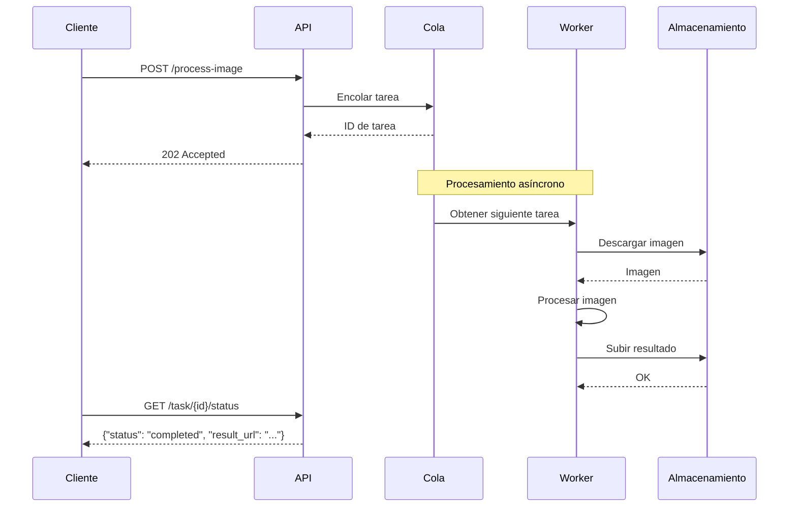

# Guía de Documentación

## 1. Estándares de Documentación

### 1.1 Principios Fundamentales

#### CLARIDAD
- Lenguaje simple y directo
- Evitar jargón técnico innecesario
- Explicar conceptos complejos con ejemplos
- Usar analogías cuando sea apropiado

#### CONSISTENCIA
- Mismo tono y estilo en toda la documentación
- Estructura uniforme en documentos similares
- Convenciones de nombres consistentes
- Formato coherente (encabezados, listas, código)

#### COMPLETITUD
- Documentar todas las funcionalidades
- Incluir ejemplos reales
- Cubrir casos de uso comunes y edge cases
- Documentar errores y soluciones

#### ACTUALIZACIÓN
- Documentación siempre sincronizada con código
- Revisar documentación en cada PR
- Actualizar con cada cambio significativo

### 1.2 Estructura de Documentos

```
# Título del Documento
Breve descripción (1-2 párrafos)

## Tabla de Contenidos
- [Sección 1](#sección-1)
- [Sección 2](#sección-2)

## Sección 1
Contenido...

### Subsección 1.1
Contenido...

## Sección 2
Contenido...

## Ejemplos
```python
# Código de ejemplo
```

## Referencias
- [Enlace 1](#)
- [Enlace 2](#)
```

## 2. Documentación de Código

### 2.1 Docstrings (Formato Google)

```python
def process_image(image_path: str, options: Dict[str, Any]) -> ProcessedImage:
    """Procesa una imagen aplicando transformaciones especificadas.
    
    Esta función carga una imagen desde el sistema de archivos, aplica una serie
    de transformaciones definidas en `options`, y retorna el resultado procesado.
    
    Args:
        image_path: Ruta absoluta o relativa al archivo de imagen
        options: Diccionario con opciones de procesamiento. Debe incluir:
            - 'resize': Tupla (ancho, alto) o None
            - 'filter': Nombre del filtro a aplicar
            - 'quality': Calidad de salida (1-100)
    
    Returns:
        Objeto ProcessedImage con la imagen resultante y metadatos
    
    Raises:
        FileNotFoundError: Si la imagen no existe en `image_path`
        ValueError: Si las opciones contienen valores inválidos
        ImageProcessingError: Si ocurre un error durante el procesamiento
    
    Examples:
        >>> options = {'resize': (800, 600), 'filter': 'sharpen', 'quality': 90}
        >>> result = process_image('/path/to/image.jpg', options)
        >>> result.save('/path/to/output.jpg')
    
    Notes:
        - Formatos soportados: JPEG, PNG, WebP
        - El procesamiento consume memoria proporcional al tamaño de imagen
        - Para lotes grandes, considerar process_image_batch()
    """
    # Implementación
```

### 2.2 Comentarios en Código

```python
# ❌ MAL - Comentario obvio
# Incrementar contador
counter += 1

# ✅ BIEN - Comentario que explica el "por qué"
# Usar 0.7 como umbral basado en pruebas A/B que mostraron mejor balance
# entre precisión y recall para nuestro dataset
THRESHOLD = 0.7

# ❌ MAL - Código complejo sin comentarios
result = [(x, y) for x in range(10) for y in range(10) if x != y and (x + y) % 3 == 0]

# ✅ BIEN - Código complejo con explicación
# Generar pares de coordenadas únicas donde la suma sea divisible por 3
# Esto es necesario para el algoritmo de distribución de carga
result = [
    (x, y) 
    for x in range(10) 
    for y in range(10) 
    if x != y and (x + y) % 3 == 0
]
```

### 2.3 README por Módulo

```markdown
# Módulo: `image_processor`

## Descripción
Procesamiento de imágenes para el pipeline de AIReels. Incluye redimensionamiento,
aplicación de filtros, conversión de formatos y optimización para web.

## Funcionalidades Principales
- Redimensionamiento inteligente manteniendo relación de aspecto
- Aplicación de filtros (blur, sharpen, grayscale)
- Optimización de imágenes para web
- Conversión entre formatos (JPEG, PNG, WebP)

## Instalación
```bash
pip install -r requirements.txt
```

## Uso Básico
```python
from image_processor import ImageProcessor

processor = ImageProcessor()
result = processor.process('input.jpg', {'resize': (800, 600)})
result.save('output.jpg')
```

## API Reference

### `ImageProcessor`
Clase principal para procesamiento de imágenes.

#### Métodos
- `process(image_path, options)`: Procesa una imagen individual
- `process_batch(image_paths, options)`: Procesa múltiples imágenes
- `get_supported_formats()`: Retorna formatos soportados

### `ImageOptions`
Clase para configurar opciones de procesamiento.

## Ejemplos
Ver [ejemplos/](examples/) para casos de uso avanzados.

## Contribución
Ver [CONTRIBUTING.md](CONTRIBUTING.md) para guías de desarrollo.
```

## 3. Documentación Técnica

### 3.1 Diagramas de Arquitectura



### 3.2 Diagramas de Secuencia



### 3.3 Especificaciones Técnicas

```markdown
# Especificación: Procesamiento de Imágenes por Lotes

## Objetivo
Procesar múltiples imágenes simultáneamente con gestión de recursos eficiente.

## Requisitos
- Procesar hasta 100 imágenes simultáneamente
- Tiempo máximo de procesamiento: 30 segundos por imagen
- Uso máximo de memoria: 2GB por worker
- Soporte para reintentos automáticos en fallos

## Diseño
### Componentes
1. **Queue Manager**: Gestiona cola de tareas
2. **Worker Pool**: Pool de workers para procesamiento
3. **Result Aggregator**: Agrega resultados individuales
4. **Progress Tracker**: Monitorea progreso

### Flujo de Datos
1. Cliente envía lote de imágenes
2. Queue Manager divide en tareas individuales
3. Worker Pool procesa en paralelo
4. Result Aggregator combina resultados
5. Progress Tracker actualiza estado

## Interfaz de API
```json
POST /api/v1/batch-process
{
  "images": ["url1", "url2", "url3"],
  "options": {
    "resize": {"width": 800, "height": 600},
    "format": "webp"
  }
}
```

## Consideraciones de Implementación
- Usar asyncio para concurrencia
- Implementar circuit breaker para dependencias externas
- Loggear métricas de rendimiento
- Configurar timeouts apropiados
```

## 4. Documentación de API

### 4.1 Especificación OpenAPI

```yaml
openapi: 3.0.0
info:
  title: AIReels API
  description: API para generación y procesamiento de contenido multimedia
  version: 1.0.0

paths:
  /api/v1/images/process:
    post:
      summary: Procesa una imagen
      description: |
        Aplica transformaciones a una imagen según las opciones especificadas.
        Soporta redimensionamiento, aplicación de filtros y conversión de formatos.
      
      requestBody:
        required: true
        content:
          application/json:
            schema:
              $ref: '#/components/schemas/ProcessImageRequest'
            examples:
              basic:
                summary: Ejemplo básico
                value:
                  image_url: "https://example.com/image.jpg"
                  options:
                    resize:
                      width: 800
                      height: 600
                    format: "webp"
      
      responses:
        '200':
          description: Imagen procesada exitosamente
          content:
            application/json:
              schema:
                $ref: '#/components/schemas/ProcessImageResponse'
        
        '400':
          description: Solicitud inválida
          content:
            application/json:
              schema:
                $ref: '#/components/schemas/ErrorResponse'

components:
  schemas:
    ProcessImageRequest:
      type: object
      required:
        - image_url
        - options
      properties:
        image_url:
          type: string
          format: uri
          description: URL de la imagen a procesar
        options:
          $ref: '#/components/schemas/ImageOptions'
    
    ImageOptions:
      type: object
      properties:
        resize:
          $ref: '#/components/schemas/ResizeOptions'
        filter:
          type: string
          enum: [none, blur, sharpen, grayscale]
        format:
          type: string
          enum: [jpeg, png, webp]
          default: jpeg
        quality:
          type: integer
          minimum: 1
          maximum: 100
          default: 85
```

### 4.2 Ejemplos de Uso

```markdown
## Ejemplos de API

### Ejemplo 1: Procesamiento básico
```bash
curl -X POST https://api.aireels.com/v1/images/process \
  -H "Content-Type: application/json" \
  -H "Authorization: Bearer $TOKEN" \
  -d '{
    "image_url": "https://example.com/photo.jpg",
    "options": {
      "resize": {"width": 800, "height": 600},
      "format": "webp",
      "quality": 90
    }
  }'
```

**Respuesta:**
```json
{
  "status": "success",
  "result_url": "https://storage.aireels.com/processed/abc123.webp",
  "processing_time": 1.23,
  "file_size_kb": 245
}
```

### Ejemplo 2: Procesamiento con filtro
```bash
curl -X POST https://api.aireels.com/v1/images/process \
  -H "Content-Type: application/json" \
  -H "Authorization: Bearer $TOKEN" \
  -d '{
    "image_url": "https://example.com/photo.jpg",
    "options": {
      "resize": {"width": 1200, "height": null},
      "filter": "sharpen",
      "format": "jpeg",
      "quality": 85
    }
  }'
```

### Ejemplo 3: Manejo de errores
```bash
# Solicitud inválida - URL incorrecta
curl -X POST https://api.aireels.com/v1/images/process \
  -H "Content-Type: application/json" \
  -d '{
    "image_url": "not-a-valid-url",
    "options": {}
  }'
```

**Respuesta de error:**
```json
{
  "error": "validation_error",
  "message": "image_url must be a valid URL",
  "details": {
    "field": "image_url",
    "value": "not-a-valid-url"
  }
}
```
```

## 5. Guías de Usuario

### 5.1 Guía de Instalación

```markdown
# Guía de Instalación - AIReels CLI

## Prerrequisitos
- Python 3.10 o superior
- pip (gestor de paquetes de Python)
- 2GB de RAM mínimo
- 500MB de espacio en disco

## Instalación en Linux/macOS

### Paso 1: Instalar Python
```bash
# Verificar versión de Python
python3 --version

# Si no está instalado, instalarlo
# Ubuntu/Debian:
sudo apt update
sudo apt install python3 python3-pip

# macOS:
brew install python
```

### Paso 2: Crear entorno virtual
```bash
# Crear directorio del proyecto
mkdir airels-project
cd airels-project

# Crear entorno virtual
python3 -m venv venv

# Activar entorno virtual
# Linux/macOS:
source venv/bin/activate

# Windows:
# venv\Scripts\activate
```

### Paso 3: Instalar AIReels CLI
```bash
# Instalar desde PyPI
pip install airels-cli

# O instalar desde repositorio
git clone https://github.com/airels/airels-cli.git
cd airels-cli
pip install -e .
```

### Paso 4: Configurar API Key
```bash
# Configurar variable de entorno
export AIRELS_API_KEY="tu_api_key_aquí"

# O guardar en archivo de configuración
airels config set api_key "tu_api_key_aquí"
```

### Paso 5: Verificar instalación
```bash
# Verificar versión
airels --version

# Verificar conectividad
airels status
```

## Solución de Problemas

### Problema: "python3 no encontrado"
**Solución:** Instalar Python 3.10 o superior

### Problema: Error de permisos al instalar
**Solución:** Usar `--user` flag o entorno virtual
```bash
pip install --user airels-cli
```

### Problema: Error de conexión API
**Solución:** Verificar API key y conectividad de red
```bash
airels config show
ping api.airels.com
```

## Próximos Pasos
- [Leer Guía de Inicio Rápido](quickstart.md)
- [Explorar Comandos Disponibles](commands.md)
- [Unirse a la Comunidad](community.md)
```

### 5.2 Tutorial Paso a Paso

```markdown
# Tutorial: Crear tu Primer Reel Automático

## Objetivo
Crear un video reel automático con imágenes generadas por IA y música de fondo.

## Duración estimada: 15 minutos

### Paso 1: Preparar imágenes
```bash
# 1. Crear carpeta para imágenes
mkdir mis-imagenes

# 2. Generar imágenes con IA
airels generate \
  --prompt "paisaje de montaña al atardecer" \
  --count 5 \
  --output mis-imagenes/

# 3. Verificar imágenes generadas
ls mis-imagenes/
# Deberías ver: image1.jpg, image2.jpg, ..., image5.jpg
```

### Paso 2: Seleccionar música
```bash
# 1. Buscar música disponible
airels music search "epic cinematic"

# 2. Seleccionar una canción (ejemplo ID: music-123)
airels music info music-123

# 3. Descargar preview
airels music download music-123 --preview
```

### Paso 3: Crear reel
```bash
# 1. Combinar imágenes en video
airels create-reel \
  --images mis-imagenes/*.jpg \
  --music music-123 \
  --duration 15 \
  --output mi-reel.mp4

# 2. Procesamiento en progreso...
# [=======>] 100% Completado
```

### Paso 4: Añadir efectos
```bash
# 1. Aplicar transiciones
airels effects add-transitions mi-reel.mp4 \
  --type "zoom" \
  --duration 0.5

# 2. Añadir texto
airels effects add-text mi-reel.mp4 \
  --text "Aventuras en la Montaña" \
  --position "center" \
  --font-size 48

# 3. Exportar resultado final
airels export mi-reel.mp4 --format mp4 --quality high
```

### Paso 5: Publicar (Opcional)
```bash
# 1. Subir a Instagram
airels publish instagram mi-reel-final.mp4 \
  --caption "Mi primer reel generado con IA! 🏔️ #airels"

# 2. O subir a TikTok
airels publish tiktok mi-reel-final.mp4 \
  --hashtags "#AI #montaña #atardecer"
```

## Resultado Esperado
- Video de 15 segundos con 5 imágenes
- Transiciones suaves entre imágenes
- Música épica de fondo
- Texto superpuesto
- Archivo listo para publicar

## Consejos y Trucos
- Usa `--preview` para ver resultados antes de procesar completo
- Experimenta con diferentes `--duration` valores (10-60 segundos)
- Prueba varias opciones de `--transitions` (zoom, fade, slide)

## Solución de Problemas
**Problema:** Video demasiado rápido/lento
**Solución:** Ajustar `--duration` o número de imágenes

**Problema:** Calidad de video baja
**Solución:** Usar `--quality high` y verificar resolución de imágenes

**Problema:** Error de formato
**Solución:** Verificar que todas las imágenes sean JPG/PNG
```

## 6. Plantillas de Documentación

### 6.1 Plantilla para Nueva Funcionalidad

```markdown
# Funcionalidad: [Nombre]

## Descripción
[Breve descripción de la funcionalidad]

## Motivación
[Por qué se necesita esta funcionalidad]

## Alcance
- [ ] Qué incluye
- [ ] Qué no incluye

## Especificación Técnica

### Componentes
- **Componente A:** [Descripción]
- **Componente B:** [Descripción]

### Flujo de Trabajo
1. Paso 1
2. Paso 2
3. Paso 3

### Interfaces
#### API
```json
{
  "endpoint": "/api/v1/...",
  "method": "POST",
  "request": {},
  "response": {}
}
```

#### Configuración
```yaml
nueva_funcionalidad:
  enabled: true
  options:
    timeout: 30
    retries: 3
```

### Dependencias
- Dependencia 1
- Dependencia 2

## Consideraciones de Implementación

### Rendimiento
[Consideraciones de rendimiento]

### Seguridad
[Consideraciones de seguridad]

### Compatibilidad
[Consideraciones de compatibilidad hacia atrás]

## Pruebas

### Casos de Prueba
- [ ] Caso 1
- [ ] Caso 2

### Criterios de Aceptación
- [ ] Criterio 1
- [ ] Criterio 2

## Documentación Requerida
- [ ] Documentación de API
- [ ] Guía de usuario
- [ ] Ejemplos de código

## Historial de Revisiones
| Fecha | Versión | Cambios | Autor |
|-------|---------|---------|-------|
| 2026-04-08 | 1.0 | Documento inicial | [Nombre] |
```

## 7. Herramientas y Automatización

### 7.1 Generación Automática de Documentación

```yaml
# mkdocs.yml
site_name: AIReels Documentation
theme:
  name: material

plugins:
  - search
  - mkdocstrings:
      handlers:
        python:
          options:
            show_source: true
            members_order: source

nav:
  - Inicio: index.md
  - Guía de Usuario:
    - Instalación: user-guide/installation.md
    - Tutorial: user-guide/tutorial.md
  - Referencia de API:
    - API v1: api/v1.md
    - Autenticación: api/authentication.md
  - Desarrollo:
    - Estándares: development/standards.md
    - Contribución: development/contributing.md

markdown_extensions:
  - admonition
  - codehilite
  - toc:
      permalink: true
```

### 7.2 Scripts de Verificación

```python
#!/usr/bin/env python3
"""
Verificador de documentación.
Valida que todo el código tenga documentación adecuada.
"""

import ast
import os
from pathlib import Path
from typing import List, Dict

class DocumentationChecker:
    def __init__(self, root_dir: str = "."):
        self.root_dir = Path(root_dir)
        self.issues: List[Dict] = []
    
    def check_python_file(self, file_path: Path) -> None:
        """Verifica documentación en archivo Python."""
        try:
            with open(file_path, 'r', encoding='utf-8') as f:
                content = f.read()
            
            tree = ast.parse(content)
            
            for node in ast.walk(tree):
                if isinstance(node, ast.FunctionDef):
                    self._check_function_doc(node, file_path)
                elif isinstance(node, ast.ClassDef):
                    self._check_class_doc(node, file_path)
        
        except Exception as e:
            self.issues.append({
                'file': str(file_path),
                'line': 0,
                'type': 'ERROR',
                'message': f'Error parsing file: {e}'
            })
    
    def _check_function_doc(self, node: ast.FunctionDef, file_path: Path) -> None:
        """Verifica docstring de función."""
        if not ast.get_docstring(node):
            self.issues.append({
                'file': str(file_path),
                'line': node.lineno,
                'type': 'WARNING',
                'message': f'Función "{node.name}" sin docstring'
            })
    
    def _check_class_doc(self, node: ast.ClassDef, file_path: Path) -> None:
        """Verifica docstring de clase."""
        if not ast.get_docstring(node):
            self.issues.append({
                'file': str(file_path),
                'line': node.lineno,
                'type': 'WARNING',
                'message': f'Clase "{node.name}" sin docstring'
            })
    
    def run(self) -> bool:
        """Ejecuta verificación en todos los archivos."""
        python_files = self.root_dir.rglob("*.py")
        
        for file_path in python_files:
            if 'test_' not in file_path.name:  # Excluir tests
                self.check_python_file(file_path)
        
        self._print_report()
        return len(self.issues) == 0
    
    def _print_report(self) -> None:
        """Imprime reporte de issues."""
        if not self.issues:
            print("✅ Todas las funciones y clases tienen documentación adecuada.")
            return
        
        print(f"❌ Se encontraron {len(self.issues)} issues:")
        for issue in self.issues:
            print(f"  {issue['file']}:{issue['line']} - {issue['type']}: {issue['message']}")

if __name__ == "__main__":
    checker = DocumentationChecker()
    success = checker.run()
    exit(0 if success else 1)
```

## 8. Checklist de Revisión de Documentación

### 8.1 Checklist para Nuevos Documentos
- [ ] Título claro y descriptivo
- [ ] Introducción que explique propósito
- [ ] Tabla de contenidos (para documentos largos)
- [ ] Estructura lógica con encabezados
- [ ] Lenguaje claro y conciso
- [ ] Ejemplos prácticos
- [ ] Código bien formateado y comentado
- [ ] Sin errores ortográficos/gramaticales
- [ ] Enlaces funcionan correctamente
- [ ] Imágenes/diagramas con texto alternativo
- [ ] Consistente con otros documentos

### 8.2 Checklist para Documentación de Código
- [ ] Docstrings en todas las funciones públicas
- [ ] Type hints completos
- [ ] Documentación de parámetros y retorno
- [ ] Ejemplos de uso
- [ ] Documentación de excepciones
- [ ] Comentarios para lógica compleja
- [ ] README actualizado para módulos
- [ ] Documentación sincronizada con código

### 8.3 Checklist para Documentación de API
- [ ] Todos los endpoints documentados
- [ ] Ejemplos de requests/responses
- [ ] Códigos de error documentados
- [ ] Parámetros y sus tipos
- [ ] Requisitos de autenticación
- [ ] Límites de rate limiting
- [ ] Versión de API clara

---

**Última actualización:** 2026-04-08  
**Responsable de mantener:** Documentator  
**Aprobado por:** Arquitecto