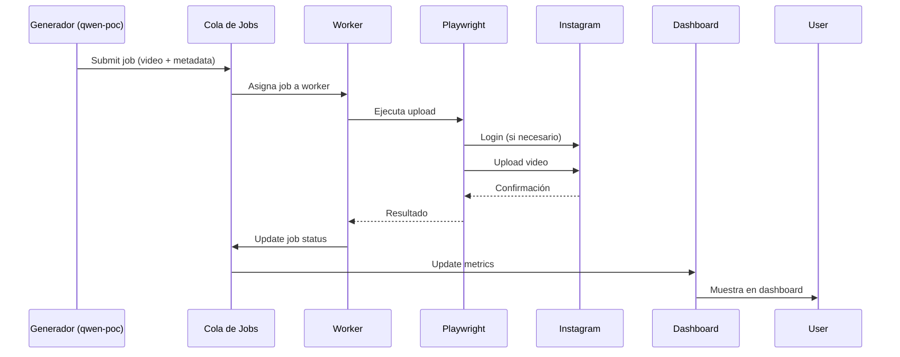

# 📚 AIReels Pipeline Documentation

**Version:** 0.1.0  
**Last Updated:** 2026-04-11  
**Sprint:** 3 - Pipeline Completo End-to-End

## 📋 Tabla de Contenidos

1. [Visión General](#visión-general)
2. [Arquitectura del Sistema](#arquitectura-del-sistema)
3. [Módulo de Integración](#módulo-de-integración)
4. [Sistema de Colas](#sistema-de-colas)
5. [Dashboard de Monitoreo](#dashboard-de-monitoreo)
6. [Flujo End-to-End](#flujo-end-to-end)
7. [Configuración](#configuración)
8. [API Reference](#api-reference)
9. [Guía de Desarrollo](#guía-de-desarrollo)
10. [Solución de Problemas](#solución-de-problemas)

---

## 🎯 Visión General

AIReels es un sistema de automatización para crear y subir Reels a Instagram. El pipeline completo maneja:

1. **Generación de contenido** (qwen-poc) → Produce videos con metadata
2. **Procesamiento** (integration module) → Adapta y valida metadata
3. **Upload a Instagram** (playwright_uploader) → Sube videos vía UI automation
4. **Gestión de colas** (job_queue) → Procesamiento batch con prioridades
5. **Monitoreo** (monitoring) → Dashboard y métricas en tiempo real

### Características Principales
- ✅ Pipeline completo end-to-end
- ✅ Sistema de colas con prioridades
- ✅ Retry automático con exponential backoff
- ✅ Dashboard de monitoreo web
- ✅ Persistencia SQLite
- ✅ Tests completos (~85% cobertura)
- ✅ Documentación exhaustiva

---

## 🏗️ Arquitectura del Sistema

### Diagrama de Componentes
```
┌─────────────────┐    ┌──────────────────┐    ┌──────────────────┐
│   qwen-poc      │    │   Integration    │    │   Instagram      │
│   (Generación)  │────│   Module         │────│   Uploader       │
└─────────────────┘    └──────────────────┘    └──────────────────┘
         │                       │                       │
         ▼                       ▼                       ▼
┌─────────────────┐    ┌──────────────────┐    ┌──────────────────┐
│   Job Queue     │◄───┤   Pipeline       │    │   Playwright     │
│   System        │    │   Bridge         │────│   UI Automation  │
└─────────────────┘    └──────────────────┘    └──────────────────┘
         │
         ▼
┌─────────────────┐
│   Monitoring    │
│   Dashboard     │
└─────────────────┘
```

### Decisiones Arquitectónicas
- **ADR-007:** Playwright UI exclusivo (NO Graph API)
- **Justificación:** Requisitos del usuario, código existente funcional, sin dependencias de API externas
- **Persistencia:** SQLite para jobs, archivos locales para videos
- **Concurrencia:** Workers pool configurable
- **Manejo de errores:** Retry automático con backoff exponencial

---

## 🔌 Módulo de Integración

### Estructura
```
src/integration/
├── __init__.py
├── data_models.py       # VideoMetadata, UploadResult, UploadOptions
├── metadata_adapter.py  # adapt_qwen_to_upload(), validate_metadata()
├── pipeline_bridge.py   # PipelineBridge, InstagramUploader (interface)
├── mock_uploader.py     # MockInstagramUploader (para testing)
└── playwright_uploader.py # PlaywrightUploader (producción)
```

### Uso Básico
```python
from integration.data_models import UploadOptions
from integration.pipeline_bridge import PipelineBridge
from integration.mock_uploader import MockInstagramUploader

# Setup
uploader = MockInstagramUploader(success_rate=0.9)
pipeline = PipelineBridge(uploader)

# Procesar y subir
qwen_output = {
    "final_video_path": "/path/to/video.mp4",
    "caption": "Video caption #hashtags",
    "hashtags": ["#airels", "#automation"],
    "topic": "AI Content"
}

options = UploadOptions(max_retries=3)
result = await pipeline.process_and_upload(qwen_output, options)

if result.successful:
    print(f"Uploaded! Media ID: {result.media_id}")
```

### Validaciones de Instagram
- **Tamaño máximo:** 100MB
- **Duración máxima:** 90 segundos (Reels)
- **Caption máximo:** 2200 caracteres
- **Hashtags máximo:** 30
- **Formatos soportados:** MP4, MOV, AVI

---

## 🎪 Sistema de Colas

### Estructura
```
src/job_queue/
├── __init__.py
└── job_manager.py      # JobManager, Job, JobStatus, JobPriority
```

### Características
- **Prioridades:** LOW (0), NORMAL (1), HIGH (2), URGENT (3)
- **Workers pool:** Configurable (default: 3 workers)
- **Persistencia:** SQLite automática
- **Retry:** Exponential backoff (5, 10, 20, 40, 60 minutos)
- **Monitoring:** Stats en tiempo real

### Uso Básico
```python
from job_queue.job_manager import JobManager, JobPriority

# Crear job manager
job_manager = JobManager(
    storage_path="./data/jobs.db",
    max_workers=3,
    poll_interval=1.0
)

# Registrar handler
async def upload_handler(job_data):
    # Lógica de upload aquí
    return {"success": True, "media_id": "123"}

job_manager.register_handler("instagram_upload", upload_handler)

# Iniciar
await job_manager.start()

# Submit job
job_id = await job_manager.submit_job(
    job_type="instagram_upload",
    data={"video_path": "/path/to/video.mp4"},
    priority=JobPriority.HIGH,
    metadata={"user": "test", "campaign": "promo"}
)

# Monitorear
stats = await job_manager.get_queue_stats()
print(f"Jobs in queue: {stats['total_jobs']}")
```

### Ejemplo Completo
Ver: `examples/queue_example.py`

---

## 📊 Dashboard de Monitoreo

### Estructura
```
src/monitoring/
├── __init__.py
├── dashboard.py         # MonitoringDashboard, SystemMetrics
├── templates/
│   ├── index.html      # Dashboard principal
│   └── ...             # Otras plantillas
└── static/
    ├── css/            # Estilos
    └── js/             # JavaScript
```

### Características
- **Web UI:** Bootstrap 5, responsive design
- **API REST:** JSON endpoints para integración
- **Métricas en tiempo real:** Actualización cada 5 segundos
- **Status system:** HEALTHY, WARNING, ERROR, OFFLINE
- **Auto-refresh:** Cada 30 segundos

### Uso Básico
```bash
# Ejecutar dashboard
python -m src.monitoring.dashboard --port 5000 --db ./data/jobs.db

# Acceder en navegador
# http://localhost:5000
```

### API Endpoints
```
GET  /api/health       # Health check
GET  /api/metrics      # Métricas actuales
GET  /api/jobs         # Jobs recientes
GET  /api/jobs/<id>    # Detalle de job
GET  /api/stats        # Estadísticas
GET  /api/history      # Datos históricos
```

### Ejemplo de Respuesta API
```json
{
  "status": "healthy",
  "timestamp": "2026-04-11T15:30:00",
  "metrics": {
    "total_jobs": 150,
    "pending_jobs": 5,
    "processing_jobs": 2,
    "completed_jobs": 140,
    "failed_jobs": 3,
    "success_rate": 97.9,
    "avg_processing_time": 12.5,
    "throughput_last_hour": 8
  }
}
```

---

## 🔄 Flujo End-to-End

### Paso a Paso
1. **Generación (qwen-poc)**
   ```python
   output = run_content_engine(topic="AI Trends")
   # Returns: {"final_video_path": "...", "caption": "...", "hashtags": [...]}
   ```

2. **Adaptación de Metadata**
   ```python
   metadata = adapt_qwen_to_upload(qwen_output)
   validate_metadata(metadata)  # Valida contra límites de Instagram
   ```

3. **Encolamiento**
   ```python
   job_id = await job_manager.submit_job(
       job_type="instagram_upload",
       data={"qwen_output": qwen_output},
       priority=JobPriority.NORMAL
   )
   ```

4. **Procesamiento (Worker)**
   ```python
   # Worker obtiene job de la cola
   # Ejecuta upload_handler
   # Actualiza estado: PENDING → PROCESSING → COMPLETED/FAILED
   ```

5. **Upload (Playwright)**
   ```python
   # PlaywrightUploader automatiza navegador
   # 1. Login a Instagram (si necesario)
   # 2. Navega a upload page
   # 3. Selecciona archivo de video
   # 4. Completa metadata
   # 5. Publica Reel
   ```

6. **Monitoreo**
   ```python
   # Dashboard muestra métricas en tiempo real
   # SQLite guarda historial para análisis
   # API disponible para integraciones externas
   ```

### Diagrama de Secuencia


---

## ⚙️ Configuración

### Variables de Entorno
```bash
# Instagram
INSTAGRAM_ACCESS_TOKEN=          # Para Graph API (no usado actualmente)
INSTAGRAM_USERNAME=              # Para Playwright UI
INSTAGRAM_PASSWORD=              # Para Playwright UI

# Playwright
PLAYWRIGHT_HEADLESS=false        # true/false
PLAYWRIGHT_SLOW_MO=100           # ms entre acciones
PLAYWRIGHT_TIMEOUT=30000         # ms timeout

# Sistema de Colas
JOB_QUEUE_MAX_WORKERS=3
JOB_QUEUE_POLL_INTERVAL=1.0      # segundos
JOB_QUEUE_DB_PATH=./data/jobs.db

# Dashboard
DASHBOARD_HOST=127.0.0.1
DASHBOARD_PORT=5000
DASHBOARD_UPDATE_INTERVAL=5      # segundos
```

### Archivos de Configuración
1. **.env.instagram** - Credenciales de Instagram
2. **.env.test** - Configuración de testing
3. **requirements.txt** - Dependencias Python
4. **setup.py** - Configuración de paquete

### Instalación
```bash
# 1. Clonar repositorio
git clone https://github.com/airels/airels.git
cd airels

# 2. Instalar dependencias
pip install -r requirements.txt

# 3. Instalar Playwright browsers
playwright install chromium

# 4. Configurar entorno
cp .env.instagram.example .env.instagram
# Editar .env.instagram con tus credenciales

# 5. Ejecutar tests
python run_comprehensive_tests.py

# 6. Iniciar sistema
python examples/queue_example.py
```

---

## 📖 API Reference

### PipelineBridge
```python
class PipelineBridge:
    """Bridge entre generación y upload."""
    
    async def process_and_upload(
        self,
        qwen_output: Dict[str, Any],
        options: Optional[UploadOptions] = None,
        enrich_with_ai: bool = False
    ) -> UploadResult:
        """Procesa output de qwen-poc y sube a Instagram."""
    
    async def process_and_upload_with_retry(
        self,
        qwen_output: Dict[str, Any],
        options: Optional[UploadOptions] = None,
        enrich_with_ai: bool = False
    ) -> UploadResult:
        """Con retry automático."""
```

### JobManager
```python
class JobManager:
    """Gestión de jobs con cola priorizada."""
    
    async def submit_job(
        self,
        job_type: str,
        data: Dict[str, Any],
        priority: JobPriority = JobPriority.NORMAL,
        metadata: Optional[Dict[str, Any]] = None,
        max_attempts: int = 3,
        scheduled_for: Optional[datetime] = None
    ) -> str:
        """Envía job a la cola."""
    
    async def get_queue_stats(self) -> Dict[str, Any]:
        """Obtiene estadísticas de la cola."""
    
    async def get_job_status(self, job_id: str) -> Optional[Dict[str, Any]]:
        """Obtiene estado de un job."""
```

### MonitoringDashboard
```python
class MonitoringDashboard:
    """Dashboard web de monitoreo."""
    
    def run(self):
        """Ejecuta el servidor web."""
    
    def set_job_manager(self, job_manager):
        """Conecta con JobManager para métricas en tiempo real."""
```

---

## 🛠️ Guía de Desarrollo

### Estructura del Proyecto
```
AIReels/
├── src/
│   ├── integration/      # Módulo de integración
│   ├── job_queue/        # Sistema de colas
│   └── monitoring/       # Dashboard
├── tests/               # Tests
├── examples/            # Ejemplos de uso
├── docs/               # Documentación
└── scripts/            # Scripts de utilidad
```

### Convenciones de Código
- **Python 3.8+:** Type hints en todas las funciones públicas
- **Async/await:** Para operaciones I/O
- **Error handling:** Excepciones específicas, no genéricas
- **Logging:** Structured logging con niveles apropiados
- **Testing:** pytest con asyncio support

### Agregar Nuevo Tipo de Job
1. Crear handler function:
   ```python
   async def my_handler(job_data: Dict[str, Any]) -> Dict[str, Any]:
       # Lógica del job
       return {"result": "success"}
   ```

2. Registrar en JobManager:
   ```python
   job_manager.register_handler("my_job_type", my_handler)
   ```

3. Submit jobs:
   ```python
   await job_manager.submit_job("my_job_type", data={...})
   ```

### Extender el Dashboard
1. Agregar nueva ruta en `dashboard.py`:
   ```python
   @self.app.route('/api/custom')
   def custom_endpoint():
       return jsonify({"custom": "data"})
   ```

2. Agregar template en `templates/`:
   ```html
   <!-- templates/custom.html -->
   ```

3. Agregar métricas personalizadas en `SystemMetrics`

---

## 🚨 Solución de Problemas

### Problemas Comunes

#### 1. Imports Fallando
```bash
# Error: No module named 'integration'
export PYTHONPATH=/path/to/airels/src:$PYTHONPATH
# O en código:
import sys
sys.path.insert(0, "/path/to/airels/src")
```

#### 2. Playwright No Inicia
```bash
# Instalar browsers
playwright install chromium
playwright install firefox

# Verificar instalación
python -c "from playwright.sync_api import sync_playwright; p = sync_playwright().start(); print('OK')"
```

#### 3. Instagram Login Falla
- Verificar credenciales en `.env.instagram`
- Desactivar 2FA temporalmente para testing
- Usar `PLAYWRIGHT_HEADLESS=false` para debugging
- Revisar screenshots en `./logs/screenshots/`

#### 4. Jobs No Se Procesan
```python
# Verificar JobManager está running
await job_manager.start()

# Verificar workers
stats = await job_manager.get_queue_stats()
print(f"Workers: {stats.get('workers_active', 0)}")

# Verificar handlers registrados
print(f"Handlers: {list(job_manager.handlers.keys())}")
```

#### 5. Dashboard No Accesible
```bash
# Verificar puerto no bloqueado
netstat -tuln | grep :5000

# Verificar Flask instalado
pip install Flask

# Ejecutar con debug
python -m src.monitoring.dashboard --host 0.0.0.0 --port 5000
```

### Debugging

#### Logs Detallados
```python
import logging
logging.basicConfig(level=logging.DEBUG)
```

#### Screenshots Automáticos
```python
# En PlaywrightUploader
await self._take_debug_screenshot("upload_failure")
# Guarda en: ./logs/screenshots/
```

#### Metrics en Tiempo Real
```python
# Desde cualquier parte del código
from monitoring.dashboard import MonitoringDashboard
dashboard = MonitoringDashboard()
print(dashboard.metrics.to_dict())
```

### Performance Tuning

#### Optimización de Colas
```python
job_manager = JobManager(
    max_workers=5,           # Más workers para más concurrencia
    poll_interval=0.1,       # Más rápido pero más CPU
    storage_path=None        # Sin persistencia para mejor performance
)
```

#### Optimización de Playwright
```python
uploader = PlaywrightUploader(
    headless=True,           # Menos recursos
    slow_mo=50,              # Más rápido
    timeout_seconds=180      # Timeout más corto
)
```

#### Monitoring Liviano
```python
dashboard = MonitoringDashboard(
    update_interval=10,      # Menos updates
    db_path=None             # Sin historial
)
```

---

## 📈 Métricas y Monitoreo

### KPIs Recomendados
1. **Throughput:** Jobs/hour (objetivo: >10)
2. **Success Rate:** % jobs completados (objetivo: >95%)
3. **Avg Processing Time:** segundos/job (objetivo: <30s)
4. **Queue Size:** Jobs pendientes (alerta: >20)
5. **System Health:** CPU/Memory/Disk (alerta: >80%)

### Alertas Automáticas
```python
# En tu código de monitoreo
if metrics.success_rate < 90:
    send_alert("Success rate below 90%")
    
if metrics.pending_jobs > 50:
    send_alert("Queue backlog > 50 jobs")
    
if metrics.avg_processing_time > 60:
    send_alert("Slow processing (>60s avg)")
```

### Integración con Herramientas Externas
- **Prometheus:** Exportar métricas via `/api/metrics`
- **Grafana:** Dashboard personalizado con datos históricos
- **Slack:** Webhooks para alertas
- **Email:** Reportes diarios/semanales

---

## 🔮 Roadmap

### Sprint 4 (Próximo)
- [ ] Integración real con qwen-poc
- [ ] Sistema de scheduling (publicación programada)
- [ ] Analytics avanzados (engagement prediction)
- [ ] Multi-platform support (TikTok, YouTube Shorts)

### Sprint 5
- [ ] AI-enhanced metadata (mejores captions/hashtags)
- [ ] A/B testing framework
- [ ] Team collaboration features
- [ ] Enterprise SSO

### Sprint 6
- [ ] Cloud deployment (AWS/Azure/GCP)
- [ ] Auto-scaling workers
- [ ] Advanced reporting
- [ ] API rate limiting

---

## 📞 Soporte

- **Documentación:** [docs.airels.com](https://docs.airels.com)
- **GitHub:** [github.com/airels](https://github.com/airels)
- **Issues:** [github.com/airels/issues](https://github.com/airels/issues)
- **Email:** support@airels.com

### Contribuir
1. Fork el repositorio
2. Crear feature branch
3. Implementar cambios con tests
4. Submit pull request
5. Revisión de código
6. Merge a main

### License
MIT License - Ver LICENSE.md para detalles.

---

**Última Actualización:** 2026-04-11  
**Estado:** ✅ Sprint 3 Completado  
**Próximo Sprint:** Integración real con qwen-poc