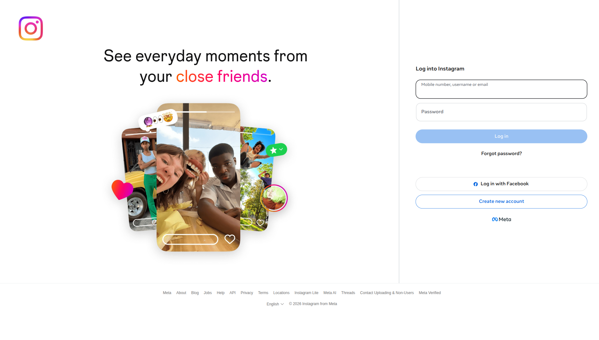

# 🧪 EXP-001: Navegación básica a Instagram sin NET::ERR_ABORTED

## 📊 RESULTADOS
✅ **Estado:** EXITOSO
⏱️ **Duración total:** 5.9 segundos
📸 **Screenshots:** 1
🚨 **Errores:** 0
⚠️ **Advertencias:** 1

## 🎯 OBJETIVO
Probar que podemos navegar a Instagram.com sin recibir error NET::ERR_ABORTED
que indica detección de automation.

## 🤔 HIPÓTESIS
Configuración de navegador con comportamiento humano (headless=false, slow_mo=1000ms)
evita que Instagram detecte automation y bloquee la carga.

## 📈 MÉTRICAS RECOLECTADAS
- **load_time_seconds:** 4.38
- **page_title:** Instagram
- **final_url:** https://www.instagram.com/
- **console_errors_count:** 0

## ⚠️ ADVERTENCIAS
- Checks fallidos: Logo Instagram visible

## 📸 EVIDENCIA VISUAL

## 🎯 CONCLUSIÓN
✅ HIPÓTESIS VALIDADA: Navegación exitosa sin NET::ERR_ABORTED

## 📝 RECOMENDACIÓN PARA SIGUIENTE EXPERIMENTO
**EXP-002:** Verificar formulario de login visible
- Objetivo: Confirmar que campo de usuario/contraseña son accesibles
- Hipótesis: Después de navegación exitosa, formulario de login está presente
---
*Ejecutado el 2026-04-13 21:50:15*
*Duración: 5.9 segundos*
