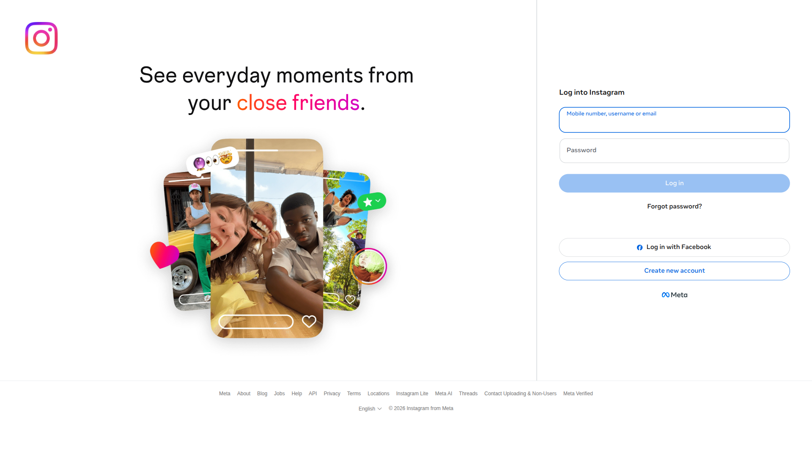

# 🧪 EXP-002: Verificar formulario de login visible

## 📊 RESULTADOS
⚠️ **Estado:** CON ADVERTENCIAS
⏱️ **Duración total:** 5.8 segundos
📸 **Screenshots:** 3
🚨 **Errores:** 0
⚠️ **Advertencias:** 1

## 🎯 OBJETIVO
Verificar que después de navegar a Instagram, el formulario de login
(campos de usuario y contraseña) son visibles y accesibles.

## 🤔 HIPÓTESIS
Después de navegación exitosa (EXP-001), Instagram muestra formulario
de login estándar con campos accesibles mediante selectores comunes.

## 📈 MÉTRICAS RECOLECTADAS
- **load_time_seconds:** 4.17
- **form_detection_time:** 0.01
- **form_selectors_found:**
- **username_selector:** input[name="email"]
- **username_enabled:** True
- **username_visible:** True
- **password_selector:** input[type="password"]
- **password_enabled:** True
- **password_visible:** True
- **login_button_selector:** div[role="button"]:has-text("Log in")
- **login_button_enabled:** False
- **login_button_visible:** True

## ⚠️ ADVERTENCIAS
- Formulario de login no encontrado con selectores estándar

## 📸 EVIDENCIA VISUAL

## 🎯 CONCLUSIÓN
⚠️ HIPÓTESIS PARCIALMENTE VALIDADA/REFUTADA
- Posiblemente ya estamos logueados
- O formulario usa selectores diferentes
- Requiere investigación adicional
## 📝 RECOMENDACIÓN PARA SIGUIENTE EXPERIMENTO
**EXP-002b:** Verificar estado de login actual
- Objetivo: Determinar si ya estamos autenticados
- Hipótesis: Usuario ya está logueado (cookie de sesión activa)
---
*Ejecutado el 2026-04-13 21:54:22*
*Duración: 5.8 segundos*
*Basado en éxito de EXP-001*
