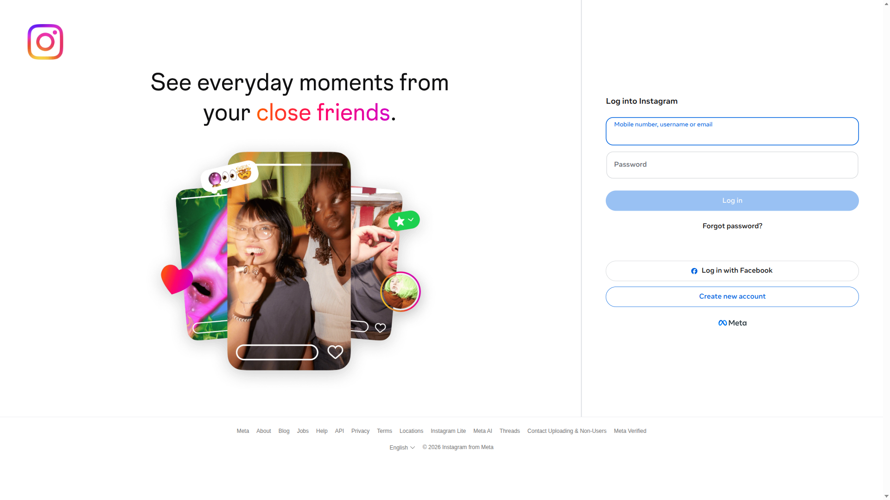

# 🧪 EXP-002b: Verificar estado de autenticación actual

## 📊 RESULTADOS
✅ **Estado:** EXITOSO
⏱️ **Duración:** 6.5 segundos
🔐 **Estado Autenticación:** NOT_AUTHENTICATED
📸 **Screenshots:** 2
🚨 **Errores:** 0

## 🎯 OBJETIVO
Determinar el estado actual de autenticación después de navegar a Instagram.

## 🤔 HIPÓTESIS
Usuario 'fiestacotoday' ya tiene sesión activa en Instagram.

## 📈 MÉTRICAS RECOLECTADAS
- **load_time:** 5.57
- **initial_url:** https://www.instagram.com/
- **auth_confidence:** 22.2
- **auth_score:** -2
- **total_cookies:** 6
- **session_cookies:** 0
- **instagram_cookies:** 6

## 🔍 INDICADORES ENCONTRADOS

### ❌ SUGIERE NO AUTENTICADO:
- Login button text
- Forgot password

## 📸 EVIDENCIA VISUAL

## 🎯 CONCLUSIÓN
❌ **NO ESTAMOS AUTENTICADOS**
- Necesitamos proceder con login completo
- Campos visibles en EXP-002 eran para login normal
## 📝 RECOMENDACIÓN PARA SIGUIENTE EXPERIMENTO
**EXP-003: Login completo con credenciales**
- Objetivo: Realizar login completo
- Hipótesis: Podemos hacer login automático con credenciales configuradas

---
*Ejecutado el 2026-04-13 21:59:04*
*Basado en resultados de EXP-002*
