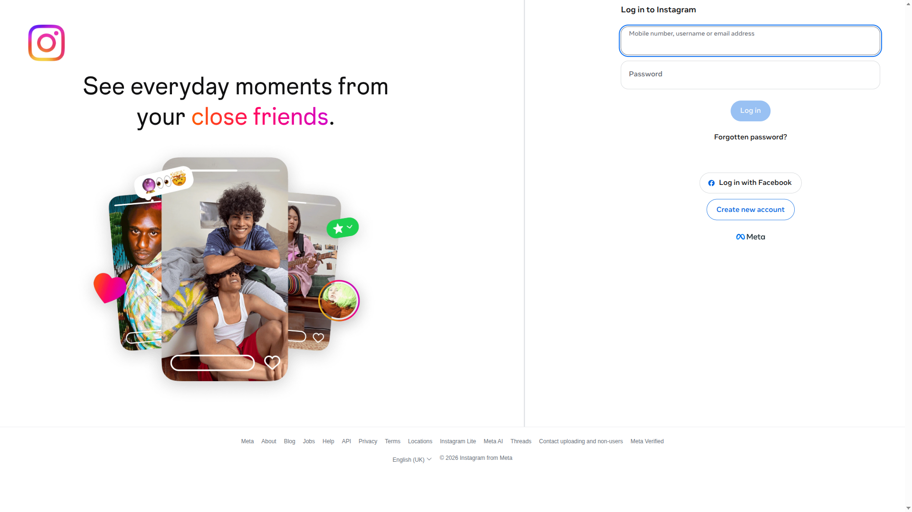
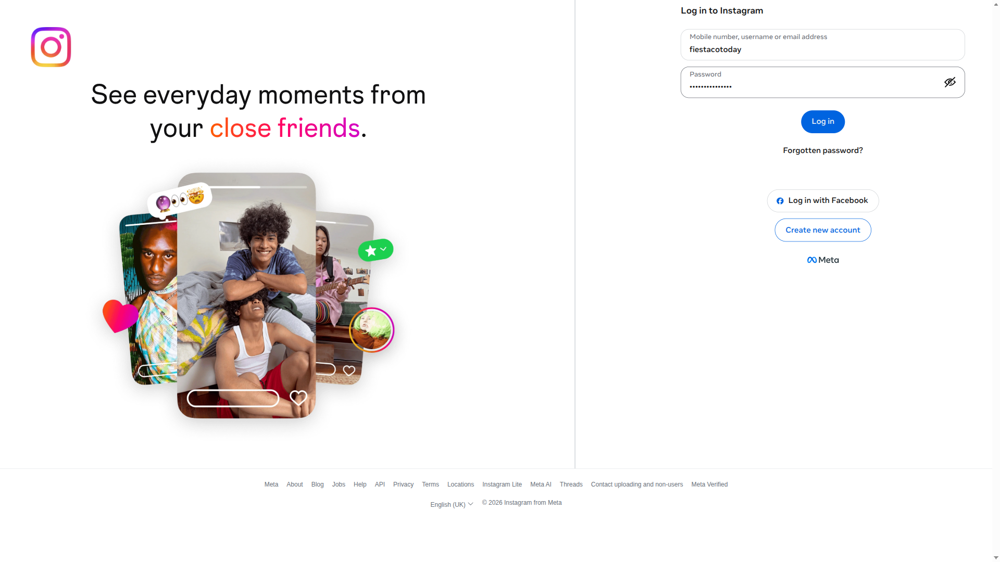
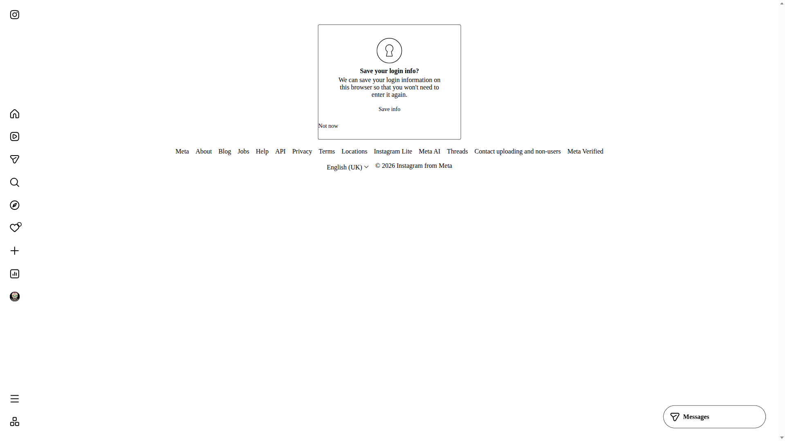
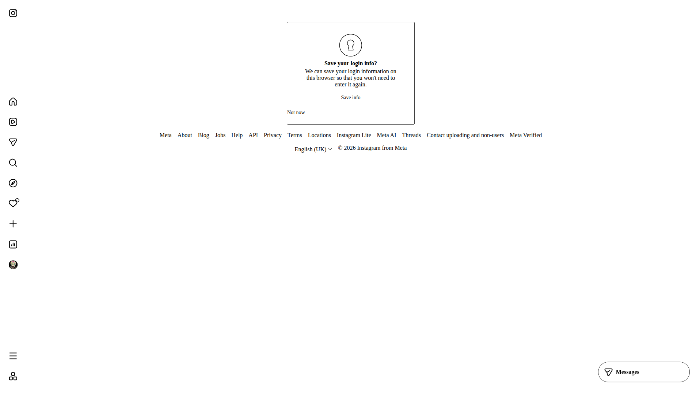

# 🧪 EXP-003: Login completo con credenciales

## 📊 RESULTADOS
❌ **Estado:** FALLIDO
⏱️ **Duración:** 22.4 segundos
📸 **Screenshots:** 5
🚨 **Errores:** 1
📋 **Pasos completados:** 5

## 🎯 OBJETIVO
Login automático completo basado en hallazgos de experimentos previos.

## 📈 DATOS
- **Usuario:** fiestacotoday
- **URL inicial:** https://www.instagram.com/
- **Pasos:** setup_complete, navigation_complete, fields_found...

## 🚨 ERRORES
- Login falló - aún en página de login

## 📸 EVIDENCIA

## 🎯 CONCLUSIÓN
❌ LOGIN FALLIDO

## 📝 SIGUIENTE EXPERIMENTO
**EXP-003b:** Debug detallado de login
- Objetivo: Identificar causa exacta de fallo
- Hipótesis: Selectores o flujo incorrectos
---
*Ejecutado el 2026-04-13 22:02:40*
*Basado en: EXP-001 (navegación), EXP-002 (campos), EXP-002b (no autenticado)*
