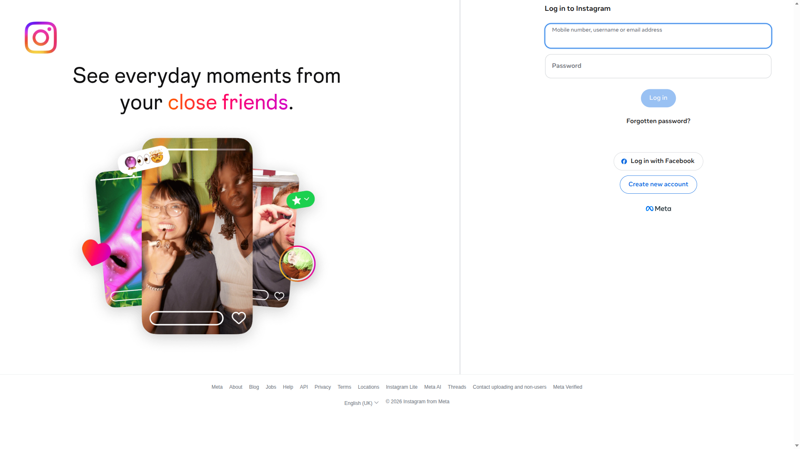
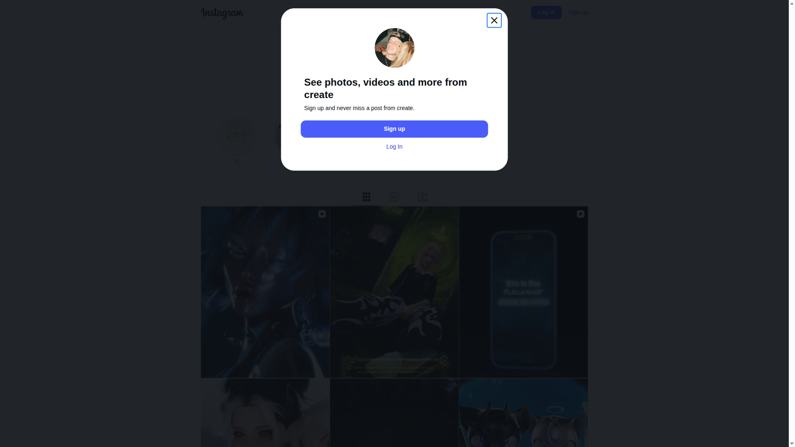
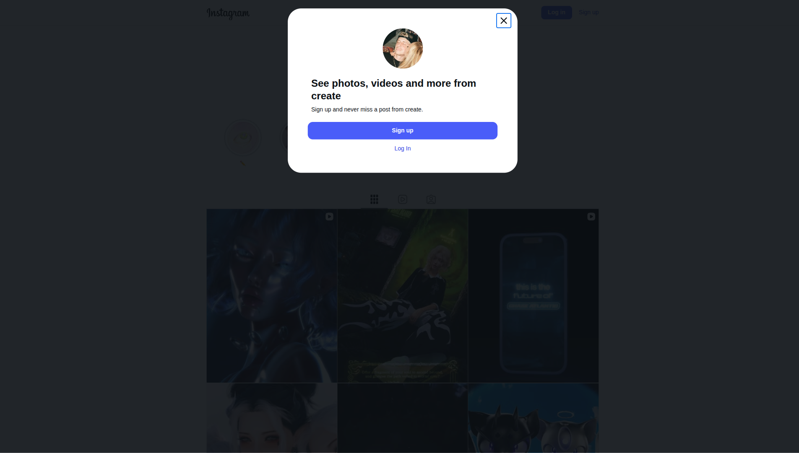

# 🚀 EXP-004: Enfoque directo a upload

## 📊 RESULTADOS
✅ **Estado:** EXITOSO
⏱️ **Duración:** 17.9 segundos
🔐 **Estado detectado:** UNKNOWN
📸 **Screenshots:** 3
🚨 **Errores:** 0
📋 **Pasos:** 6
🎥 **Video disponible:** ✅ Sí

## 🎯 OBJETIVO
Probar navegación directa a página de upload, manejando cualquier estado de autenticación.

## 📈 DATOS CLAVE
- **URL inicial:** https://www.instagram.com/
- **Estado autenticación:** UNKNOWN
- **Página upload accesible:** ✅ Sí
- **Elementos upload encontrados:** ✅ Sí

## 📋 PASOS EJECUTADOS
1. browser_configured
2. instagram_loaded
3. state_determined_UNKNOWN
4. upload_navigation_success
5. upload_elements_found
6. video_found_test_video_aireels.mp4

## 📸 EVIDENCIA VISUAL

## 🎯 CONCLUSIÓN
**✅ UPLOAD VIABLE DETECTADO**
- Página de upload accesible directamente
- Elementos clave presentes
- Video disponible para upload
- **¡Listo para intentar upload real!**
## 📝 SIGUIENTE EXPERIMENTO
**EXP-005: Upload real de video**
- Objetivo: Realizar upload real
- Hipótesis: Podemos subir video exitosamente

## 💡 RECOMENDACIÓN INMEDIATA
**¡EJECUTAR UPLOAD REAL AHORA!**
- Usar video encontrado
- Implementar selección de archivo
- Probar publicación completa
---
*Ejecutado el 2026-04-13 22:11:38*
*Basado en aprendizajes de EXP-001 a EXP-003*
